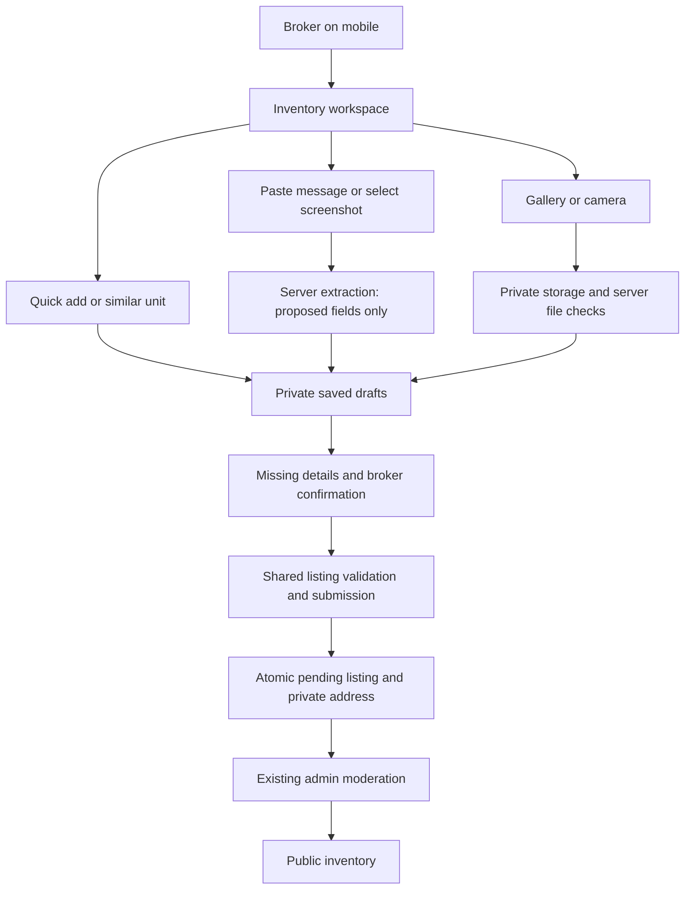

# Broker fast inventory: implementation architecture

Status: proposed architecture, not implemented. Prepared 7 October 2026 against the running app in `/Users/anand/Downloads/settle`.

The product is a mobile inventory workspace for brokers who remember homes, receive messages/photos, and learn details from owners. It does not depend on spreadsheets. Voice recording, speech transcription and microphone access are excluded.

## 1. Broker experience

Add an **Add homes fast** button to the broker dashboard. It opens `/broker/inventory`, with private drafts and submitted inventory, filters by building/status, and a resumable editor at `?draft=<id>`.

Three entry paths feed the same editor:

| Entry | Broker action | Result |
| --- | --- | --- |
| Quick add | Select a building, enter a flat/unit reference and tap through BHK, rent, area, furnishing and availability | A saved partial draft |
| Add a similar unit | Duplicate selected facts from an existing draft/listing | A new draft with a new unit identity and unconfirmed property-specific facts |
| Message or screenshot | Paste selected property messages or upload selected screenshots, then review extracted cards | One or more proposed drafts |

On mobile use cards and ordinary inputs/buttons. On desktop the same drafts can appear as editable rows. Keep the existing full listing form available for detailed entry. No spreadsheet library or separate mobile app is required.

The editor has three sections: **Home details**, **Photos**, **Finish missing details**. Show a sticky Save/Submit action and an honest Saved/Saving/Not saved indicator. Never display Saved until the server acknowledges the current revision.

Building details are optional for standalone houses. For grouped units, save the city, locality, building/street address and explicitly chosen common amenities once. Combine those details with the unit reference to create the full private address used by property matching.

Save brokerage, visit-fee/refund policy and other-fee defaults only after the broker supplies them. Unknown is not zero. Copy defaults into each new draft as a snapshot; changing a building/default later must not silently change existing drafts or live listings.

Rent, deposit, furnishing, availability, owner identity, owner permission and photos require checking for each unit. Duplication never copies permission, a completed verification state, property IDs, enquiries or reviews. Photos are not copied automatically between distinct units.

Generate an editable title/description from confirmed facts to satisfy the current form requirements. Do not add unsupported claims such as metro proximity, luxury finishes or owner verification.

## 2. Architecture

Use the existing Next.js app, Supabase Auth/Postgres/Storage and installed Supabase SDK. Keep route handlers thin. Introduce one server listing-submission function used by both the existing form and draft submission; extract the current route logic instead of duplicating it in a bulk handler.

Keep the existing `validateListing`, approved-city checks, property identity normalization, SHA-256 checks, `submit_listing` transaction and admin moderation. Draft-specific persistence allows incomplete information; public submission still requires the complete listing contract.

For edits, consolidate the currently duplicated partial validation in `src/app/api/listings/[id]/route.ts` with the new draft field checks. Reuse the actual validators and moderation rules, rather than creating a second collection with different limits.

## 3. Data model

Four new tables support real requirements; no separate worker/queue system is needed initially.

| Table | Important fields | Purpose |
| --- | --- | --- |
| `broker_buildings` | `id`, `broker_id`, `label`, `city`, `locality`, private address parts, explicit defaults, `revision`, timestamps | Reusable building context scoped to its broker |
| `listing_drafts` | `id`, `broker_id`, optional `building_id`, partial `fields` JSON, field origins/confirmations, `revision`, optional source request/index, `submitted_listing_id`, archived flag, timestamps | Saved incomplete homes, correction tracking and stable submission identity |
| `inventory_assets` | `id`, `broker_id`, owning draft or source request, kind, private storage path, validated MIME/size/SHA-256, upload state, timestamps | Property photos and source screenshots; source screenshots can never become listing photos automatically |
| `inventory_requests` | `id`, `broker_id`, authenticated actor, kind, immutable input hash, bounded input/results, state, attempt/lease, timestamps | Durable receipts for extraction, batch submission and availability actions; retry and quota accounting |

Draft readiness is derived from current fields, confirmed fee/authority choices, completed photo assets and the shared validator. Do not persist a second `ready` boolean that can become stale.

Use a unique `(source_request_id, source_index)` for extracted drafts. Retrying the same extraction result cannot create another set of homes. Keep pending/failed uploads separate from ready assets.

Add an optional `source_draft_id` with a unique constraint and a server-maintained `revision` to existing listings. All listing writers, including moderation/reconfirmation, must advance the revision. The source draft protects submission retries; the revision protects edits and batch actions against stale screens.

All new tables have RLS enabled and no public-read policy. API queries derive broker/actor identity from the session, not submitted IDs. Index draft lists by broker/update time and building; index assets by parent; index request ownership/date for quota and recovery lookups.

## 4. API boundaries

| Endpoint | Responsibility |
| --- | --- |
| `GET/POST /api/broker/buildings`, `PATCH /api/broker/buildings/[id]` | Own building context/defaults; explicit revision check on edits |
| `GET/POST /api/broker/drafts`, `PATCH /api/broker/drafts/[id]` | Paginated own drafts, partial validated saves, duplication, archive; reject stale revisions |
| `POST /api/broker/drafts/assets` | Reserve a bounded asset slot and issue an upload token for a server-chosen object path |
| `POST /api/broker/drafts/assets/[id]/complete` | Verify the uploaded bytes, MIME, size, owner/parent and server hash before marking usable |
| `POST /api/broker/capture` | Create an extraction request from selected text or validated source screenshots |
| `POST /api/broker/capture/[id]/extract` | Run one bounded extraction attempt; persist validated candidates atomically |
| `GET /api/broker/inventory-requests/[id]` | Return an own request's progress/receipt after refresh or connection loss |
| `POST /api/broker/drafts/submit` | Submit at most 10 selected drafts/revisions per request; per-item results |
| `POST /api/broker/inventory/actions` | Apply one explicit availability action to at most 20 selected listing IDs/revisions |
| `GET /api/inventory-media/[id]` | Serve authorised photo access; never expose source screenshots through the public path |

These are proposed endpoints, not routes currently present on the website. Reuse `authorize`, `userBrokerId`, `requireAal2`, `body`, `invalid` and `unavailable`.

Initially require a verified, active broker for the new workflow's writes. Allow scoped reads of existing drafts when the account needs review so users can recover their own work. Any admin preview/action requires MFA. Recheck the broker's current status at submission/action time.

## 5. Message and screenshot extraction

The broker explicitly selects text/images and clicks **Create drafts**. There is no automatic WhatsApp account access, chat scraping or WhatsApp integration in this design.

Use one server-side text/image request with schema-constrained output. The proposed provider is OpenAI's Responses API with a configurable compatible model; use native `fetch`, not another SDK. Structured output constrains shape, not factual accuracy. [Official structured-output documentation](https://developers.openai.com/api/docs/guides/structured-outputs).

Return an array of partial property candidates. Each extracted value carries a source excerpt/reference and is marked proposed. Unknown values are null, ambiguous candidates require a broker decision, and truncated/refused/invalid responses create no listings. The server validates sizes, enums, numeric ranges and dates before saving candidates. Explicit units such as one-month deposit can be calculated from an explicit rent in server code and displayed for confirmation.

The model cannot set broker/owner IDs, authorisation, verification, freshness, upload ownership or public status. Input messages/images are untrusted data and have no tools or ability to perform actions. Changing a confirmed value or photo assignment invalidates the relevant prior confirmation.

Initial request bounds: 10,000 text characters OR up to three screenshots, at most 10 candidates, one active extraction per broker, a 30-second provider timeout and a bounded retry count. No recursive splitting, crawling, agents or vector database. Manual quick add remains usable when extraction is off or unavailable.

Persist a processing lease in the request row before calling the provider. A committed completed request returns its existing candidates. An expired unfinished lease can be explicitly retried; output persistence uses the source/index uniqueness constraint. An interrupted provider call can still incur duplicate provider cost on retry, so do not promise exactly-once billing.

Screenshots can contain unreadable small text or ambiguous content. Require confirmation of every extracted field and provide a direct correction path. [Official vision limitations](https://developers.openai.com/api/docs/guides/images-vision).

Before enabling extraction, disclose the actual processor and data use in the Privacy Notice and UI. Keep credentials server-side, send only selected inputs, offer cropping/removal of unrelated contact/identity details, and use `store: false`. This is not a promise of zero provider retention; actual account/endpoint controls govern retention. [Official data controls](https://developers.openai.com/api/docs/guides/your-data).

## 6. Photos and private media

Use a private `inventory-media` bucket for new workflow assets. Keep the existing public `listing-photos` bucket for legacy listings/profile behaviour; do not migrate or expose source screenshots as a shortcut. Private buckets support restricted access and time-limited signed reads. [Supabase bucket documentation](https://supabase.com/docs/guides/storage/buckets/fundamentals).

Allocate one immutable object key per asset. The server authenticates ownership and reserves quota before signing. Upload directly from the phone to Supabase with the installed SDK, up to three files concurrently. Signed upload tokens grant access to their object path and currently last two hours; keep them out of logs and use no overwrite permission. [Signed upload documentation](https://supabase.com/docs/reference/javascript/storage-from-createsigneduploadurl), [upload API](https://supabase.com/docs/reference/javascript/storage-from-uploadtosignedurl).

Completion downloads and checks the stored file server-side, preserving the current file-byte/MIME/size protections and authoritative SHA-256. A client hash or an uploaded object alone does not make an asset trusted. Handle unsupported phone formats with a visible request to choose JPEG/PNG/WEBP; do not pretend HEIC is supported by today's uploader.

Keep the current limits of eight final photos per home and 5 MB per stored asset. Assign photos while that unit's card is open. Multiple selected homes use an explicit assignment tray with unit labels/thumbnails; do not guess photo-to-flat matches with AI or require brokers to rename hundreds of files.

Persist asset IDs and ordered assignments. For new listings, extend the server listing mapper to resolve linked assets into image URLs while keeping the existing `photos: string[]` component contract. Never persist expiring signed URLs as the permanent photo identity or fake a valid URL to pass validation. Photo-count validation must resolve and verify the actual assets.

The media endpoint permits a source image only to its owner or an authorised MFA reviewer. Property-photo public access follows the existing listing visibility rules; pending/hidden drafts require owner/reviewer access. Source screenshots are not attached to public listings. Use short signed previews and appropriate private/public caching; already-issued signed links have bounded expiry, not instant revocation.

No cross-system photo-copy transaction is required: assets remain private and their visibility changes through the authorised listing reference. Failed uploads retry individually. After a reload, completed assets remain linked; local files that never completed uploading may need reselection. Full offline photo storage and byte-level resumable uploads are not part of the first version.

## 7. Submission and retry safety

The client sends stable request IDs, selected draft IDs and expected revisions; it does not send trusted verification, actor or broker fields. A repeated request ID with different content returns 409.

For each draft the server resolves stored building snapshots, partial facts, confirmed choices and usable owned media. It runs the complete shared listing validation and duplicate checks. Missing owner identity/permission, full address, mandatory fees, area, availability or photos blocks that draft, not the entire batch. Title/description generation only uses confirmed facts.

One database transaction locks the draft, checks ownership, the expected revision and current broker state, inserts the pending listing and private address using the existing atomic submission path, links its assets, records `submitted_listing_id` and writes the request item result. A repeat returns that listing. Concurrent submit/edit attempts cannot produce two listings or publish an unreviewed revision.

Retain the current exact-address property matching across brokers. A unit must have its own address/reference. A repeated own listing prompts opening the existing record rather than blind creation; a different broker advertising the same home remains a legitimate separate listing under the shared property identity, subject to review. Exact-photo matches remain review signals and transformed images remain a manual-review limit.

Process up to 10 drafts per request and show per-row success/error. The client continues with subsequent chunks while open; database receipts support recovery after closing. Do not issue 100 existing single-listing HTTP calls or keep a single long server request open. Background completion while the browser is closed is not promised by this first design.

Admin queues group the resulting pending listings by broker/building/request and expose fee/photo/duplicate differences for efficient review. Each approval still needs a checked listing and its own atomic decision/audit record. A batch is not proof and does not become automatically verified.

## 8. Bulk availability

The workspace lets a broker select own listings and choose **Taken**, **On Hold**, **Available**, or **Reconfirm checked homes**. Show the affected count and exceptions before the action.

Use the same server ownership, validation and moderation functions for single and batch actions. A database transaction per item checks expected revision and broker/listing eligibility and records the item receipt with its update. A retry returns its recorded result; another user's or admin's intervening edit becomes a visible conflict. Invalid IDs do not grant access to other brokers' records.

Marking Available does not itself refresh the confirmation clock. Reconfirmation needs an explicit availability statement and is limited to eligible approved/stale listings whose broker is still verified. Taken/On Hold records require an explicit return-to-available decision. Pending/flagged records cannot bypass review. Editing price/fees/photos still triggers re-review, and copying/importing a record never silently refreshes old inventory.

When refactoring, address the current reconfirm handler's separate broker precheck and listing update together: the new transaction must not allow a concurrent suspension/moderation decision to be overwritten. Route the existing reconfirm button through the same guarded operation.

## 9. Recovery, quotas and retention

Autosave draft text on blur and after a short debounce, using expected revisions. Keep an account-scoped local text outbox in native IndexedDB for unsent edits; clear it at logout and require the same authenticated account before replay. Concurrent device edits return a conflict rather than overwriting. Catch browser storage/quota failures and keep an explicit unsaved warning. Never claim that unuploaded photos survive a tab close.

Bounded starting limits are design defaults to validate in a pilot: 200 active drafts per broker, eight property photos per draft, three source screenshots per extraction, three concurrent uploads, one extraction in flight, ten submissions and twenty availability actions per request. A global selected count can exceed a chunk size; the UI processes it in chunks.

Use transactional database reservations for upload count/bytes and extraction usage so refreshed pages, changed IPs and parallel server instances cannot bypass budgets. Charge validated usage per item, not merely per HTTP request. Set a pilot total-media budget and daily model-spend cap before enabling extraction; release expired unused reservations. Keep the existing in-memory limiter as extra request friction, not the authoritative bulk quota.

Extend the existing retention cron instead of adding another scheduling service. Proposed policies: source text/screenshots expire after seven days; unattached/unfinished uploads after 24 hours (after issued upload-token expiry); unused drafts after 90 days with a prior notice; linked listing photos follow listing retention. Preserve any documented legal/dispute hold and leave buildings until the broker removes them or closes the account. Redact raw source inputs from request receipts after extraction/expiry; review remaining operation receipts under the existing accountability retention policy.

These are new product retention choices, not legal requirements. Publish them before activation. Cleanup must check current references and exclude active submissions/holds before deleting storage objects, and report retryable failures instead of silently dropping links.

## 10. Implementation order and acceptance

| Slice | Deliverable | Required evidence |
| --- | --- | --- |
| 1 | Shared listing operations, private draft schema, building/default snapshots, mobile quick add and similar-unit creation | Current form still passes; incomplete drafts cannot leak; unknown fees and permissions remain unconfirmed |
| 2 | Private media allocation/upload/validation, assignment tray, autosave and resume | Wrong broker access denied; source image never public; failed/reselected uploads do not attach to the wrong unit |
| 3 | Idempotent chunked submission and grouped admin review | Repeated/concurrent submission creates one listing; address/draft/receipt changes roll back together; material changes require review |
| 4 | Bulk availability/reconfirmation through shared guarded operations | Suspension/moderation races, stale revisions and foreign IDs cannot reactivate inventory; partial results are recoverable |
| 5 | Text/screenshot extraction and provider disclosures | Ambiguous/incorrect/malicious input remains a proposed draft; timeout/refusal preserves manual entry; retry creates no duplicate candidates |

Use one runnable live-check script following the existing `scripts/policies-e2e.mjs` pattern, with scoped temporary brokers/drafts/assets and cleanup. Cover access, idempotency, interrupted batches, atomic rollback, stale revisions, fee/authority omissions, photo mismatches, broker suspension, media privacy and known extraction examples. Run relevant lint/types/build plus phone/browser interaction checks at each delivered slice.

Pilot with a verified broker's 100 homes and realistic mobile photos. Measure median/slow-case hands-on time per completed listing, fields retyped, failed uploads, resumed work, extraction corrections, moderation time and storage/provider cost. The initial UX target is a partial draft in under a minute; no promise that 100 accurate complete listings appear instantly.

The initial architecture adds no microservice, message broker, Redis, automatic WhatsApp integration, spreadsheet workflow, OCR pipeline separate from the image model, microphone feature or new application framework. Add a background worker only if measured processing limits or a requirement to continue work with the browser closed makes foreground chunks insufficient.
